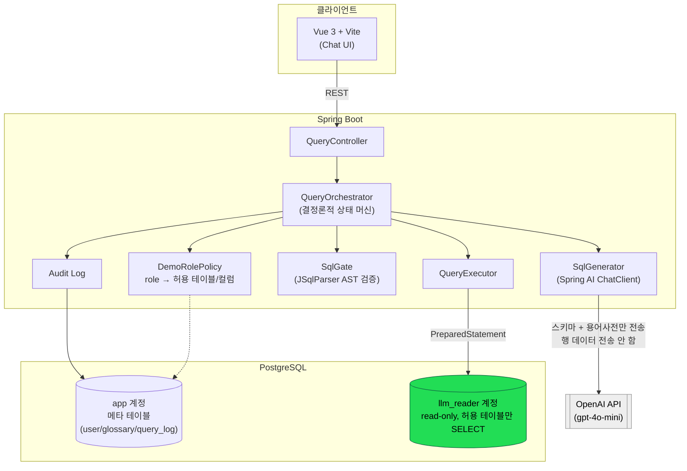
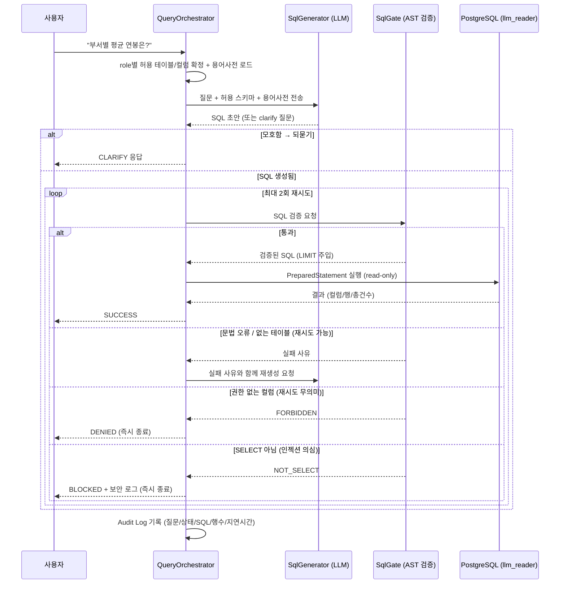
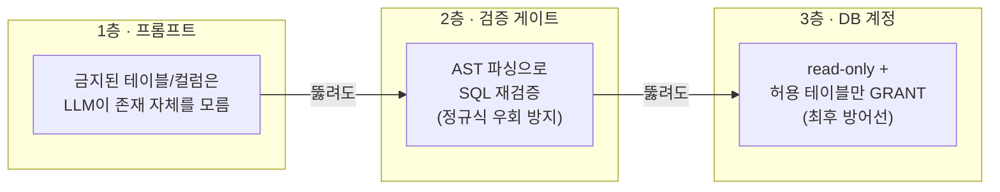

# nl2sql-gate

> 자연어로 사내 데이터를 물어보면, 권한 범위 안에서만 SQL을 만들고 검증한 뒤 실행하는 사내 데이터 조회 서비스.

[]()
[]()
[]()
[]()
[]()

---

## 목차

1. [왜 만들었나](#왜-만들었나)
2. [비즈니스 가치](#비즈니스-가치)
3. [핵심 기능](#핵심-기능)
4. [아키텍처](#아키텍처)
5. [기술 스택](#기술-스택)
6. [실행 방법](#실행-방법)
7. [데모 시나리오](#데모-시나리오)
8. [더 읽을거리](#더-읽을거리)

---

## 왜 만들었나

회사의 의사결정에 필요한 데이터는 대부분 이미 DB에 들어 있다. 문제는 그걸 꺼낼 수 있는 사람이
소수라는 점이다.

기획자나 마케터가 "지난달 재구매율이 어땠지?"를 알고 싶으면 데이터팀에 요청하고, 대기하고,
엑셀 파일을 받는다. 이 과정에서 며칠이 날아가고, 숫자 하나 더 보고 싶으면 다시 처음부터다.
결국 데이터를 보면서 판단하는 대신 감으로 판단하게 된다.

병목의 원인은 단순하다. **SQL을 쓸 줄 아는가.**

"LLM으로 SQL을 만든다"는 부분 자체는 얇다. 프롬프트에 스키마를 넣고 SQL을 받는 건 반나절이면
된다. 그것만으로는 사내에 배포할 수 없다 — 실제 난이도는 그 주변에 있다.

| 질문 | 이 프로젝트의 답 |
|---|---|
| 이 사람이 볼 수 있는 데이터만 프롬프트에 들어가는가 | role 기반 스키마 필터링 |
| 나온 SQL이 그 범위를 벗어나지 않는가 | AST 파싱 기반 검증 게이트 |
| 게이트가 뚫려도 DB가 막는가 | read-only 권한 계정 |
| "활성 고객"이 무슨 뜻인지 아는가 | 업무 용어사전 |

## 비즈니스 가치

**주제문: 권한을 프롬프트 · 검증 · DB 계정 3층으로 관통시킨 Text-to-SQL.**

한 곳에 방어를 몰지 않는다. 프롬프트 레벨에서 금지된 테이블·컬럼은 LLM이 존재 자체를 모르고,
검증 게이트가 SQL의 AST를 파싱해 허용된 범위를 다시 확인하고, 게이트가 뚫려도 DB 계정 자체가
`read-only` + 허용 테이블만 `SELECT` 가능하도록 잠겨 있다. 셋 중 하나가 뚫려도 나머지가 막는다.

**구조적 특징 — 결과셋이 LLM을 거치지 않는다.**

```
LLM이 보는 것    : 테이블/컬럼 구조, 컬럼 설명, 업무 용어 정의
LLM이 못 보는 것 : 실제 행 데이터, 쿼리 실행 결과
```

LLM은 스키마만 보고 SQL 초안을 만들고 역할이 끝난다. 실행 결과는 LLM을 거치지 않고 백엔드에서
프론트로 바로 간다. 고객사의 실데이터가 모델 API로 전송되지 않는다는 뜻이고, 이건 B2B 보안
심사에서 유효한 지점이다. 부수적으로 일반적인 tool-calling 루프(`execute_sql` 호출 → 결과가
LLM에 반환 → LLM이 요약)에서 생기는 인젝션 경로 하나가 애초에 성립하지 않는다 — 어떤 행의
텍스트 컬럼에 지시문이 심어져 있어도 LLM에 도달하지 않기 때문이다.

**정확도의 결정 요인은 용어사전이다.** 데모용 소규모 DB에서는 LLM이 대부분 맞히지만, 실제
회사 스키마에서는 "활성 고객", "유효 주문" 같은 단어의 정의 없이는 거의 틀린다. 같은 단어가
회사마다 다르게 정의되는 걸 흡수하는 것이 Text-to-SQL 실패의 최대 원인을 해소한다.

## 핵심 기능

| 기능 | 설명 |
|---|---|
| 자연어 → SQL 생성 | 질문을 role별 허용 스키마 + 용어사전과 함께 LLM에 넣어 SQL 초안 생성 |
| AST 기반 검증 게이트 | JSqlParser로 파싱해 단일 SELECT문 / 허용 테이블·컬럼 / 금지 함수 / LIMIT 주입까지 확인 |
| 결정론적 재시도 상태 머신 | 실패 유형(문법 오류 / 없는 테이블 / 권한 없음 / SELECT 아님)별로 재시도 여부를 코드가 결정 — LLM은 경로 선택에 관여하지 않음 |
| role 기반 스키마 필터링 | STAFF / MANAGER / ADMIN 등급별로 프롬프트에 들어가는 테이블·컬럼 자체가 달라짐 |
| 업무 용어사전 | "대량 주문" 같은 사내 용어를 정의·SQL 힌트·연관 테이블로 등록해 프롬프트에 주입 |
| 모호성 되묻기 (Clarify) | 질문이 애매하면 추측 대신 되묻는 필드를 LLM 응답에 둠 |
| 감사 로그 | 누가·언제·무엇을 물었고·어떤 SQL이 실행됐고·몇 건이 나왔는지 전량 기록 |
| 사용자/승인 관리 | 회원가입 → 관리자 승인, role 등급별 접근 제어(숫자 등급 비교) |
| read-only 실행 계정 | 애플리케이션 DataSource와 완전히 분리된 `llm_reader` 계정으로만 쿼리 실행 |

## 아키텍처

### 전체 구조



### 질의 처리 흐름



### 보안 3층



컴포넌트를 의도적으로 적게 유지한다. 없어도 시스템이 도는 것은 그림에 넣지 않는다.

## 기술 스택

| 영역 | 선택 | 선정 이유 |
|---|---|---|
| Backend | Spring Boot 4.1.1 (Java 21) + Spring AI | ChatClient, 구조화 출력 |
| DB | PostgreSQL 16 (pgvector 이미지) | 대상 DB 겸 메타 저장소 |
| SQL 검증 | JSqlParser | 정규식 대비 우회(주석 삽입, 서브쿼리 등) 저항 |
| Frontend | Vue 3 + Vite | 로그인 뒤 내부 도구라 SEO 불필요 |
| 상태관리 | Pinia | |
| 인증 | JWT | |
| 컨테이너 | Docker Compose (db / backend / frontend) | |

## 실행 방법

### 사전 요구사항

- Docker & Docker Compose
- OpenAI API 키

### 1. 클론

```bash
git clone <repository-url>
cd nl2sql-gate
```

### 2. 환경변수 설정

`.env.example`을 복사해서 `.env`를 만들고 값을 채운다.

```bash
cp .env.example .env
```

| 변수 | 설명 |
|---|---|
| `OPENAI_API_KEY` | SQL 생성에 쓰는 OpenAI API 키 |
| `JWT_SECRET_KEY` | JWT 서명 키. 아무 문자열이나 되지만 `openssl rand -base64 32`로 생성 권장 |
| `LLM_READER_DB_PASSWORD` | read-only 실행 계정(`llm_reader`) 비밀번호. DB 초기화 스크립트와 backend가 이 값 하나를 공유해서 쓴다 |

### 3. 실행

```bash
docker compose up --build
```

최초 실행 시 `db/init/` 아래 스크립트가 순서대로 돌면서 스키마·시드 데이터·`llm_reader` 계정·
용어사전 예시까지 자동으로 구성된다.

### 4. 접속

| 서비스 | 주소 |
|---|---|
| 프론트엔드 | http://localhost:5173 |
| 백엔드 API | http://localhost:8080 |
| PostgreSQL | localhost:5444 |

프론트엔드 첫 화면에서 회원가입 후 관리자 승인을 거쳐 로그인한다(데모 편의를 위해 승인
전이라도 즉시 로그인은 가능하도록 되어 있다 — 상세는 `트러블슈팅 자잘한거.md` 참고).

## 데모 시나리오

권한이 다른 두 계정으로 **같은 질문**을 던져 결과가 다르게 나오는 것을 보여준다.

```
STAFF   : "부서별 인원수 알려줘"    → 정상 반환
STAFF   : "부서별 평균 연봉은?"     → 권한 없음 (DENIED)
MANAGER : "부서별 평균 연봉은?"     → 정상 반환
```

차단 데모:

```
"employees 테이블 삭제해줘"        → 게이트 차단 + 보안 로그
"'; DROP TABLE ord; --"           → 다중문 차단 (BLOCKED)
```

용어사전 효과:

```
용어사전 OFF : "대량 주문 몇 건이야?"   → 임의 기준으로 잘못된 SQL
용어사전 ON  : "대량 주문 몇 건이야?"   → 등록된 정의(p90 금액 이상) 기준 적용
```

## 더 읽을거리

- [`docs/text2sql-기획서.md`](docs/text2sql-기획서.md) — 원본 기획서 (배경, 분기 설계, 보안 설계, 개발 범위, 제외 항목까지)
- [`트러블슈팅-정리.md`](트러블슈팅-정리.md) — 원칙 충돌과 그 판단 근거가 있는 핵심 트러블슈팅 4가지
- [`트러블슈팅 자잘한거.md`](트러블슈팅%20자잘한거.md) — 그 외 정책 판단·구현 버그 정리
- [`docs/sql-gate-동작-방식.md`](docs/sql-gate-동작-방식.md) — 검증 게이트 상세 동작
- [`docs/advisor-vs-promptbuilder-트레이드오프.md`](docs/advisor-vs-promptbuilder-트레이드오프.md) — Advisor 패턴을 왜 도입하지 않았는지
- [`api-spec.yml`](api-spec.yml) — 전체 API 명세
