# nl2sql-gate

> 자연어로 사내 데이터를 물어보면, **권한 범위 안에서만** SQL을 만들고 검증한 뒤 실행하는 사내 데이터 조회 서비스


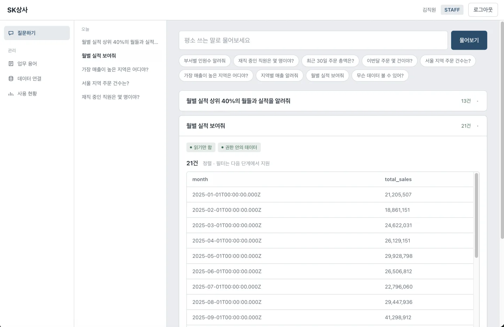

---

## 목차

1. [Pain Point](#1-pain-point)
2. [핵심 설계](#2-핵심-설계)
3. [주요 기능 & 화면](#3-주요-기능--화면)
4. [아키텍처](#4-아키텍처)
5. [기술 스택 & 선택 이유](#5-기술-스택--선택-이유)
6. [데모 시나리오](#6-데모-시나리오)
7. [한계 & 확장 방향](#7-한계--확장-방향)
8. [실행 방법](#8-실행-방법)

---

## 1. Pain Point

### 데이터는 있는데, 꺼낼 수 있는 사람이 없다

의사결정에 필요한 데이터는 대부분 이미 DB에 있습니다. 하지만 기획자가 "지난달 지역별 매출"을 보려면 데이터팀에 요청하고, 기다리고, 엑셀을 받아야 합니다.
숫자 하나를 더 보려면 이 과정을 처음부터 반복해야 합니다. 병목은 결국 **SQL을 쓸 줄 아는가** 하나입니다.

### LLM을 붙이면 해결될까? 이번엔 보안이 막는다

LLM으로 SQL을 만드는 것 자체는 어렵지 않습니다. 프롬프트에 스키마를 넣으면 SQL이 나옵니다.
하지만 그대로는 사내에 배포할 수 없습니다. 실제 난이도는 SQL 생성이 아니라 그 **주변**에 있습니다.

| Pain Point                                                                  | 해결                            |
| --------------------------------------------------------------------------- | ------------------------------- |
| 직원마다 볼 수 있는 데이터가 다른데, LLM은 모든 테이블을 알고 있다          | role 기반 스키마 필터링         |
| LLM이 만든 SQL이 권한 밖 데이터를 조회하거나 `DROP`을 실행할 수 있다        | AST 파싱 기반 검증 게이트       |
| 검증 로직에 구멍이 나면 막을 방법이 없다                                    | read-only 전용 DB 계정          |
| 고객사의 실데이터가 외부 LLM API로 전송된다                                 | 결과셋이 LLM을 거치지 않는 구조 |
| "대량 주문", "활성 고객"의 정의가 회사마다 달라 LLM이 추측으로 SQL을 만든다 | 업무 용어사전                   |

---

## 2. 핵심 설계

### 2-1. 권한을 3개 층으로 관통시킨다

방어를 한 곳에 몰지 않습니다. 각 층은 앞 층의 결과를 신뢰하지 않고 **독립적으로 다시 확인**합니다.
한 층에서 놓친 SQL도 다음 층에서 걸러집니다.

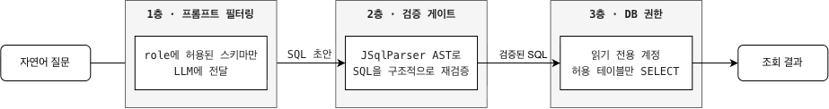

| 층              | 역할                                                                                                   |
| --------------- | ------------------------------------------------------------------------------------------------------ |
| 프롬프트 필터링 | 권한 밖 컬럼은 프롬프트에 넣지 않아 LLM이 알 수 없게 함. 컨텍스트가 줄어 **보안과 정확도를 함께** 확보 |
| 검증 게이트     | 생성된 SQL이 허용 범위 안에 있는지 확인하고, **왜 거부됐는지 설명**하는 책임도 맡음                    |
| DB 권한         | 게이트를 통과한 SQL이라도 쓰기나 허용 밖 테이블 조회는 DB가 거부하는 **최후 방어선**                   |

검증 게이트는 정규식이 아니라 **AST 파싱**으로 검사합니다. `SEL/**/ECT` 같은 주석 삽입, CTE 내부 서브쿼리, 대소문자 변형으로는 우회되지 않습니다.

- 문장 수가 정확히 1개인지 확인 (`'; DROP TABLE ...` 차단)
- SELECT 문인지 확인 (`SELECT INTO`도 사실상 쓰기로 보고 차단)
- CTE 이름을 실테이블 후보에서 제외하고, CTE 본문의 컬럼까지 검사
- 테이블·컬럼 화이트리스트를 검사하고 `SELECT *` 금지
- 금지 함수(`pg_read_file`, `dblink` 등) 차단
- LIMIT이 없으면 자동 주입

### 2-2. 결과셋은 LLM을 거치지 않는다

```
LLM이 보는 것    : 테이블/컬럼 구조, 컬럼 설명, 업무 용어 정의
LLM이 못 보는 것 : 실제 행 데이터, 쿼리 실행 결과
```

LLM은 스키마만 보고 SQL 초안을 만든 뒤 역할이 끝납니다. 실행 결과는 백엔드에서 프론트로 바로 갑니다.

- **고객사의 실데이터가 모델 API로 전송되지 않습니다.** B2B 보안 심사에서 유효한 지점입니다.
- 행 데이터에 심어진 지시문이 LLM에 도달하지 않아 **인젝션 표면이 줄어듭니다.** 통제할 수 없는 행 데이터 대신 관리자가 작성한 메타데이터만 LLM에 들어갑니다.
- 대가도 있습니다. "요약해줘" 같은 결과 해석은 할 수 없고, "그중에 서울만"은 결과 필터링이 아니라 이전 SQL을 수정하는 방식으로 처리합니다.

### 2-3. 재시도 경로는 LLM이 아니라 코드가 결정한다

검증에 실패했을 때 "다시 해볼까?"를 LLM에게 맡기지 않습니다.
게이트가 반환한 `FailureType`에 따라 **결정론적 상태 머신**이 다음 경로를 정합니다.

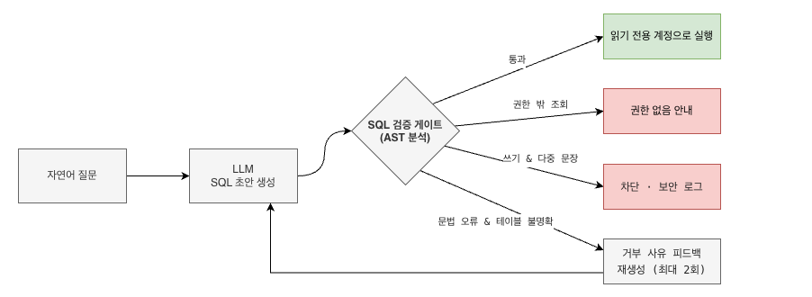

| 실패 유형                       | 경로                               | 이유                                                |
| ------------------------------- | ---------------------------------- | --------------------------------------------------- |
| `SYNTAX` 문법 오류              | 실패 사유를 담아 재생성 (최대 2회) | 생성 품질 문제라 고쳐질 여지가 있음                 |
| `UNKNOWN_TABLE` 컬럼 소속 불명  | 실패 사유를 담아 재생성 (최대 2회) | 생성 품질 문제라 고쳐질 여지가 있음                 |
| `FORBIDDEN` 권한 밖 테이블·컬럼 | 즉시 **DENIED**                    | 몇 번을 다시 해도 결론이 같음                       |
| `NOT_SELECT` DDL·DML·다중문     | 즉시 **BLOCKED** + 보안 로그       | 재시도를 허용하면 표현을 바꿔 우회할 기회를 주게 됨 |

재시도 여부를 가르는 기준은 실패 원인이 **생성 품질**인지, **의도(권한 위반·인젝션)**인지입니다.
LLM이 스스로 판단하는 분기는 **모호한 질문을 되묻는 Clarify** 하나로 한정했습니다.

### 2-4. 정확도는 용어사전이 좌우한다

데모용 소규모 DB에서는 LLM이 대부분 맞힙니다. 하지만 실제 회사에서는 "활성 고객", "대량 주문"의 정의 없이는 대부분 틀립니다.
같은 단어가 회사마다 다르게 정의되기 때문입니다.
용어를 **정의 · SQL 힌트 · 연관 테이블**로 등록해 프롬프트에 주입하면, 모델은 추측 대신 회사가 정한 기준으로 SQL을 만듭니다.

프롬프트 구성에서도 한 가지 원칙을 지켰습니다. **금지는 말하지 않고, 허용은 구조로 표현합니다.**
처음에는 "이 테이블 조합은 JOIN하면 안 된다"는 경고 문장을 넣었습니다. 그러자 모델이 무관한 질문에서도 그 문장을 그대로 복사해 되묻기 시작했습니다.
그래서 경고 문장을 지우고 실제 존재하는 FK만 구조화해 선언하는 방식으로 바꿨습니다.


---

## 3. 주요 기능 & 화면

| 기능                 | 설명                                                                                          |
| -------------------- | --------------------------------------------------------------------------------------------- |
| 자연어 → SQL 생성    | role별 허용 스키마와 용어사전을 함께 넣어 SQL 초안 생성 (구조화 출력)                         |
| AST 검증 게이트      | 단일 SELECT, 허용 테이블·컬럼, 금지 함수 검사, LIMIT 주입                                     |
| 결정론적 재시도      | 실패 유형별로 재시도할지 즉시 종료할지 코드가 결정                                            |
| 모호성 되묻기        | 질문이 애매하면 추측하지 않고 되물음 (Clarify)                                                |
| role 기반 접근 제어  | STAFF / MANAGER / ADMIN을 숫자 등급으로 비교해, role마다 프롬프트에 들어가는 컬럼 자체가 다름 |
| 업무 용어사전        | 사내 용어의 정의, SQL 힌트, 연관 테이블 관리                                                  |
| 감사 로그 · 사용현황 | 누가 언제 무엇을 물었는지, 실행된 SQL, 결과 건수, 지연시간, 재시도 횟수를 전량 기록           |
| 구성원 관리          | 회원가입과 승인, 상위 role만 하위 role을 수정 가능                                            |

<table>
  <tr>
    <td>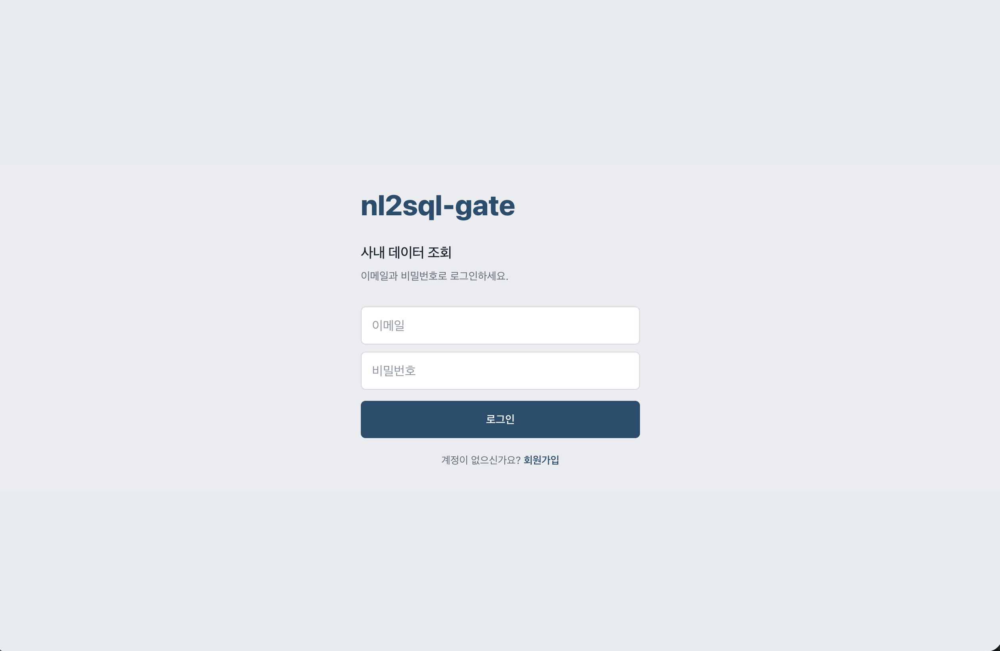<br/><sub>로그인</sub></td>
    <td>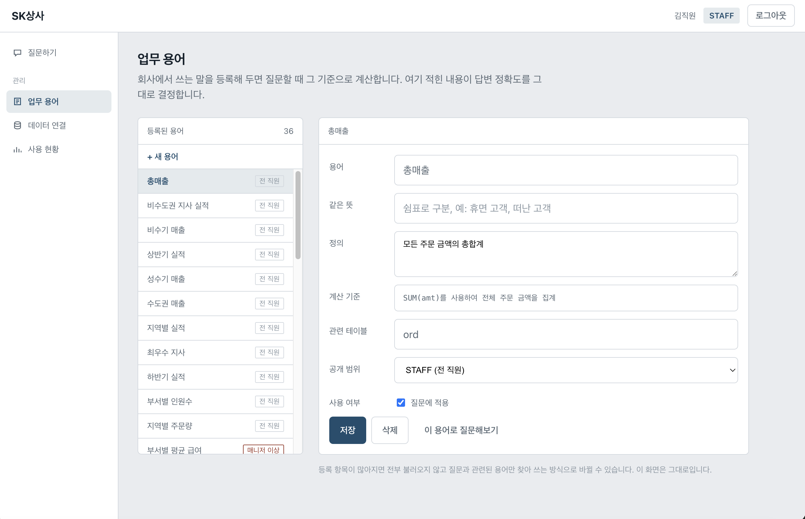<br/><sub>업무 용어사전</sub></td>
  </tr>
  <tr>
    <td>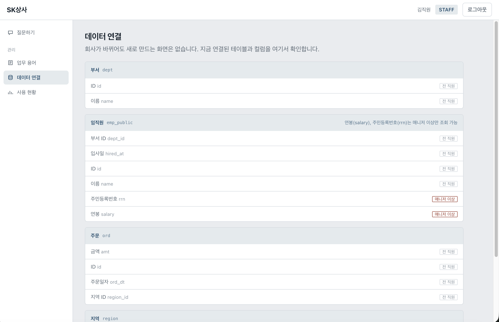<br/><sub>데이터 연결 현황 (role별 노출 컬럼)</sub></td>
    <td>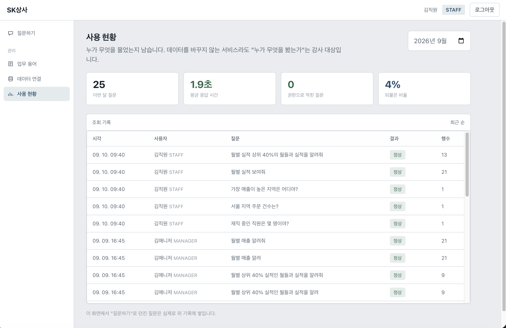<br/><sub>사용현황 · 감사 로그</sub></td>
  </tr>
  <tr>
    <td>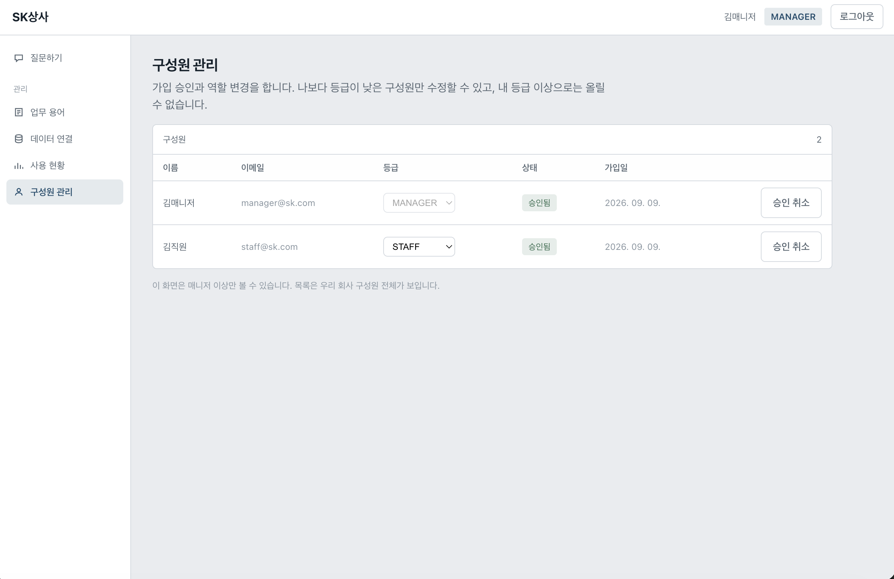<br/><sub>구성원 관리</sub></td>
    <td><br/><sub>회원가입</sub></td>
  </tr>
</table>

---

## 4. 아키텍처

### 전체 구조

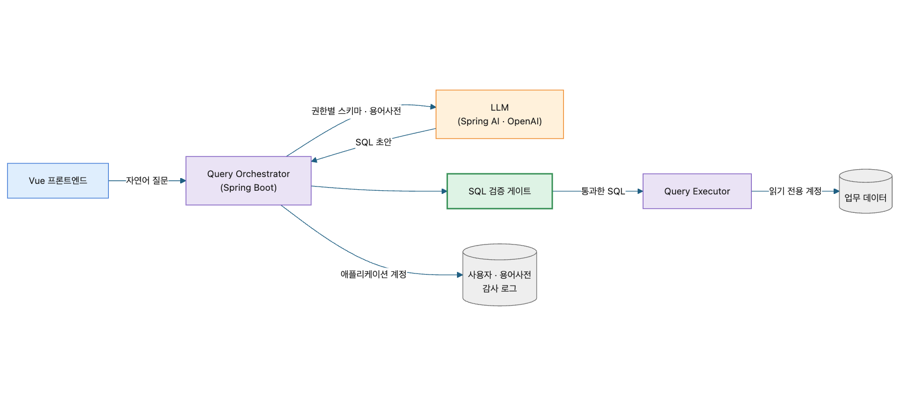

- 외부로 나가는 트래픽은 **OpenAI 호출 하나뿐**이고, DB 통신은 모두 Docker Compose 내부 네트워크에서 끝납니다.
- 애플리케이션 계정과 읽기 전용 계정은 같은 DB를 쓰지만 **커넥션 풀과 트랜잭션 매니저를 완전히 분리**했습니다. 같은 풀을 쓰면 read-only 설정이 의미를 잃습니다.
- JWT의 `tenantId`는 인증부터 용어사전, 감사 로그까지 모든 DB 접근에 필터 조건으로 들어갑니다.

### ERD

<table>
  <tr>
    <td>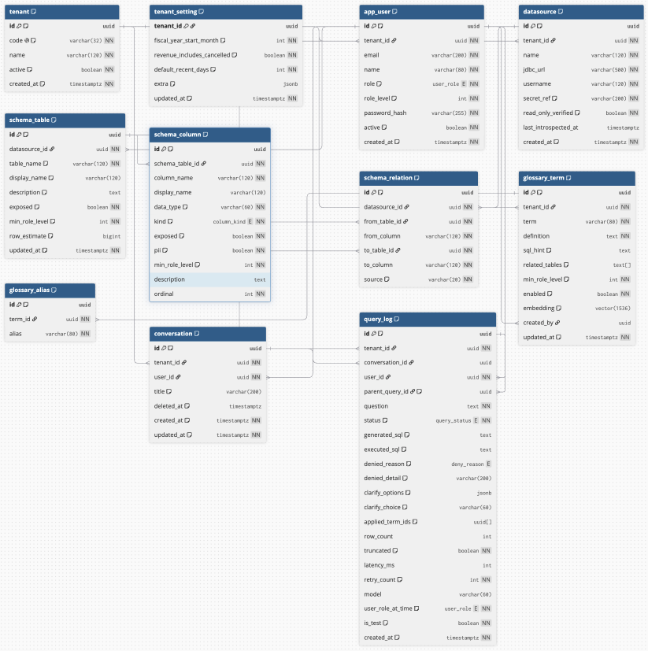</td>
    <td>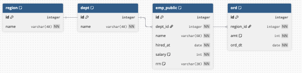</td>
  </tr>
</table>

API 명세: [`api-spec.yml`](assets/api-spec.yml) · DB 스키마: [`nl2sql-gate-DB.dbml`](assets/nl2sql-gate-DB.dbml)

---

## 5. 기술 스택 & 선택 이유

| 영역        | 선택                                     | 이유                                                                                              |
| ----------- | ---------------------------------------- | ------------------------------------------------------------------------------------------------- |
| Backend     | Spring Boot 4.1.1 · Java 21              |                                                                                                   |
| LLM 연동    | Spring AI ChatClient + 구조화 출력       | SQL, 파라미터, 되묻기 필드를 객체로 받아 파싱 코드를 없앰                                         |
| 모델        | gpt-4o-mini · temperature 0              | SQL 생성에는 창의성이 필요 없고, 같은 질문에는 같은 SQL이 나와야 디버깅이 가능                    |
| SQL 검증    | JSqlParser (AST)                         | 정규식은 주석 삽입, 서브쿼리, 대소문자 변형으로 우회됨                                            |
| 데이터 접근 | JdbcTemplate                             | 주 작업이 **LLM이 만든 임의의 SELECT 실행**이라 엔티티 매핑이 성립하지 않음                       |
| DB          | PostgreSQL 16 (pgvector 이미지)          | 회사마다 다른 건 메타데이터의 **내용**이지 **구조**가 아님. RBAC와 조인이 필요해 RDB + JSONB 선택 |
| Frontend    | Vue 3 + Vite + Pinia                     | 로그인 뒤에만 쓰는 내부 도구라 SSR/SEO가 필요 없음                                                |
| 인증        | JWT                                      |                                                                                                   |
| 인프라      | Docker Compose (db / backend / frontend) | 초기화 스크립트로 스키마, 시드, read-only 계정, 용어사전까지 자동 구성                            |

### 지금 넣지 않은 것과 도입 시점

"쓸 수 있다"가 아니라 **"지금 필요한가"**를 기준으로 판단했습니다. 없어도 시스템이 도는 컴포넌트는 아키텍처에 넣지 않았습니다.

| 항목                       | 지금 넣지 않은 이유                                                                                                       | 도입 시점                                                                                                                                                                 |
| -------------------------- | ------------------------------------------------------------------------------------------------------------------------- | ------------------------------------------------------------------------------------------------------------------------------------------------------------------------- |
| **pgvector (RAG)**         | 현재 용어사전과 스키마 규모에서는 **전량 주입이 더 정확하고 단순함**. RAG가 필요한 건 용어사전이 아니라 **큰 용어사전**임 | 용어사전 약 100개 이상, 테이블 약 50개 이상. pgvector 이미지와 임베딩 필드는 이미 준비해 둠. 도입할 때는 벡터 검색 자체가 `tenant_id`와 `min_role_level` 필터를 거쳐야 함 |
| **Redis**                  | 사용자마다 질문이 달라 결과 캐시 적중률이 낮음. 정책 캐시는 인메모리로 충분함                                             | 인스턴스가 2대 이상이 될 때. 캐시 키에 role을 포함해야 하위 권한 사용자가 상위 권한 캐시를 조회하지 않음                                                                  |
| **Spring AI Advisor 체인** | 현재는 단일 프롬프트 빌더로 충분함                                                                                        | System/User 메시지 분리, 응답 후검증, RAG 확장 시점                                                                                                                       |
| **질문 분해 멀티쿼리**     | LLM이 서브쿼리와 윈도우 함수로 한 번에 처리하는 경우가 많아 분해가 필요한 케이스가 적음                                   |                                                                                                                                                                           |

---

## 6. 데모 시나리오

**같은 질문, 다른 권한**

```
STAFF   : "부서별 인원수 알려줘"   → SUCCESS
STAFF   : "부서별 평균 연봉은?"    → DENIED   (salary는 MANAGER 이상)
MANAGER : "부서별 평균 연봉은?"    → SUCCESS
```

**차단**

```
"employees 테이블 삭제해줘"        → BLOCKED + 보안 로그
"'; DROP TABLE ord; --"           → BLOCKED (다중문)
```

**용어사전 효과**

```
용어사전 OFF : "대량 주문 몇 건이야?"   → 임의 기준으로 SQL 생성
용어사전 ON  : "대량 주문 몇 건이야?"   → 등록된 정의(주문 금액 p90 이상) 적용
```

---

## 7. 한계 & 확장 방향

**현재 한계**

- **검증 게이트 범위**: `IN (SELECT ...)` 서브쿼리 내부 컬럼, 2단계 이상 중첩된 CTE, `UNION`의 컬럼 단위 검사는 아직 하지 않습니다. 이 구간은 DB 계정 권한(3층)에 의존합니다.
- **role 정책**: 현재 role별 허용 테이블·컬럼 정책은 코드에 정의되어 있습니다. 고객사가 늘면 DB로 옮길 예정입니다.
- **감사 재현성**: 보안 원칙상 SQL 파라미터 값을 저장하지 않아, 지난 질문을 결과 표까지 그대로 재실행할 수는 없습니다. **최소한만 저장한다**는 원칙과 **재현 가능해야 한다**는 요구가 충돌하는 지점이라 의도적으로 보류했습니다.

**확장 방향**

- **벡터 검색 도입**: 용어사전과 스키마가 커지면 pgvector로 관련 항목만 골라 주입합니다. 검색 단계부터 권한 필터를 적용합니다.
- **의도 라우팅**: "무슨 테이블 있어?" 같은 메타데이터 질문과 "그중에 서울만" 같은 후속 질문을 구분해 파이프라인을 나눕니다.
- **용어사전 수치 분리**: 임계값(예: "급감 = -30%")은 회사의 운영 지표를 역산할 수 있는 정보입니다. 개념 정의만 프롬프트에 넣고, 수치는 실행 시점에 DB에서 조인합니다.

---

## 8. 실행 방법

```bash
cp .env.example .env    # OPENAI_API_KEY, JWT_SECRET_KEY, LLM_READER_DB_PASSWORD 입력
docker compose up --build
```

| 서비스     | 주소                  |
| ---------- | --------------------- |
| 프론트엔드 | http://localhost:5173 |
| 백엔드 API | http://localhost:8080 |
| PostgreSQL | localhost:5444        |

최초 실행 시 `db/init/` 스크립트가 스키마, 시드 데이터, `llm_reader` 계정, 용어사전 예시를 자동으로 구성합니다.
